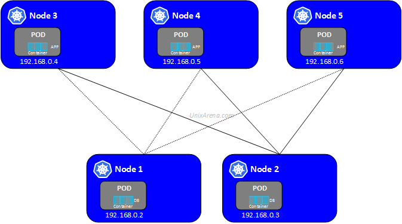
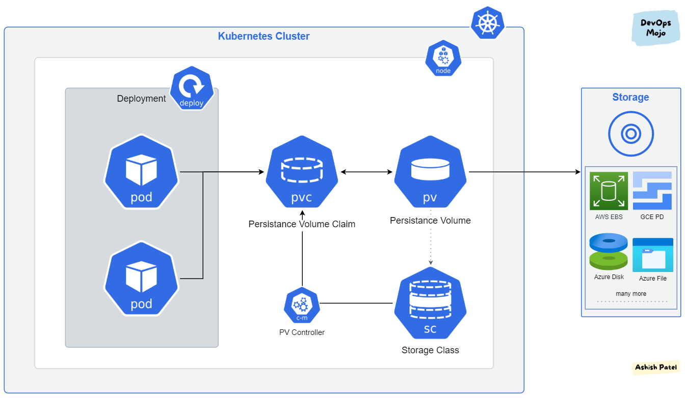

# Temario de Kubernetes desde cero para convertirme en un microservicio

## 1.0 Introducción a Kubernetes
- ¿Qué es Kubernetes?
- Beneficios y características de Kubernetes
- Arquitectura básica de Kubernetes
- Conceptos clave: clústeres, nodos, pods, servicios, volúmenes, etc.

## 2.0 Configuración del entorno de desarrollo
- Instalación de Docker
- Instalación de kubectl (CLI de Kubernetes)
- Configuración de un clúster de Kubernetes local (por ejemplo, minikube o kind)

## 3.0 Pods y Deployments
- Creación y administración de pods
- Trabajando con deployments
- Escalado horizontal y vertical de aplicaciones

## 4.0 Servicios en Kubernetes
- Exponiendo aplicaciones mediante servicios
- Tipos de servicios (ClusterIP, NodePort, LoadBalancer)
- Descubrimiento de servicios y DNS en Kubernetes

## 5.0 Almacenamiento en Kubernetes
- Volúmenes persistentes y almacenamiento en contenedores
- Provisión de almacenamiento en Kubernetes
- Gestión de volúmenes y reclamaciones de almacenamiento

## 6.0 Gestión de la configuración
- ConfigMaps: gestión de configuración y variables de entorno
- Secrets: almacenamiento seguro de información sensible
- Inyección de configuración en los contenedores

## 7.0 Monitoreo y registro de aplicaciones
- Supervisión de aplicaciones y recursos en Kubernetes
- Implementación de métricas y registros
- Uso de herramientas como Prometheus, Grafana y Elasticsearch

## 8.0 Escalado automático y alta disponibilidad
- Configuración de políticas de escalado automático
- Gestión de carga y balanceo de carga
- Estrategias de alta disponibilidad en Kubernetes

## 9.0 Gestión de la configuración y despliegues avanzados
- Helm: gestión de paquetes de aplicaciones Kubernetes
- Versionado y control de versiones de despliegues
- Despliegues canarios y de liberación gradual (blue-green deployments)

## 10.0 Implementación de microservicios en Kubernetes
- Diseño y despliegue de arquitecturas de microservicios
- Comunicación entre microservicios
- Implementación de patrones de tolerancia a fallos y recuperación

## 11.0 Seguridad en Kubernetes
- Conceptos de seguridad en Kubernetes
- Configuración de políticas de acceso y autorización
- Implementación de servicios seguros en Kubernetes

## 12.0 Operaciones avanzadas y administración del clúster
- Actualización y escalado de clústeres
- Resolución de problemas y depuración de aplicaciones
- Gestión de recursos y límites en Kubernetes


## 1.0 Introducción a Kubernetes    


### ¿Qué es Kubernetes? 

Kubernetes es una plataforma de código abierto diseñada para automatizar y administrar aplicaciones en contenedores a gran escala. También se le conoce como K8s, que es una abreviatura del nombre Kubernetes en el que se reemplazan los 8 caracteres "ubernete" con el número 8.

En pocas palabras, Kubernetes facilita la orquestación y gestión de contenedores en un entorno de clúster. Permite desplegar, escalar y administrar aplicaciones en contenedores de manera eficiente y confiable.


### Beneficios y características de Kubernetes


Kubernetes ofrece una serie de beneficios y características que lo convierten en una plataforma popular para la gestión de contenedores a gran escala. A continuación, se presentan algunos de los principales beneficios y características de Kubernetes:

1. **Escalabilidad y capacidad de respuesta**: Kubernetes permite escalar automáticamente las aplicaciones en función de la demanda de tráfico o la utilización de recursos. Puede aumentar o disminuir el número de réplicas de los contenedores de forma dinámica, lo que facilita la adaptación a cargas variables y garantiza una alta capacidad de respuesta.

2. **Alta disponibilidad y tolerancia a fallos**: Kubernetes proporciona mecanismos para la detección y recuperación automática de fallos en los nodos o contenedores. Si un nodo o contenedor falla, Kubernetes puede reprogramar automáticamente las tareas en otros nodos disponibles, lo que garantiza que las aplicaciones se ejecuten de manera continua y confiable.

3. **Despliegue y actualización declarativa**: Kubernetes permite definir la configuración de las aplicaciones mediante archivos de configuración en formato YAML o JSON. Esto permite un enfoque declarativo, donde se describe el estado deseado de la aplicación y Kubernetes se encarga de llevarla a cabo. Además, Kubernetes facilita las actualizaciones de aplicaciones sin tiempo de inactividad al implementar nuevas versiones gradualmente.

4. **Gestión y orquestación de contenedores**: Kubernetes administra y coordina la ejecución de contenedores en un clúster, lo que simplifica la administración de aplicaciones complejas que constan de múltiples contenedores interconectados. Proporciona herramientas para la programación, distribución, supervisión y escalado de contenedores de manera eficiente.

5. **Servicios y descubrimiento de servicios**: Kubernetes ofrece un sistema de servicios que permite exponer aplicaciones dentro del clúster y descubrirlas de manera transparente. Los servicios facilitan la comunicación entre los componentes de la aplicación y permiten la conectividad flexible y confiable entre los diferentes servicios.

6. **Gestión de la configuración y secretos**: Kubernetes proporciona mecanismos para la gestión centralizada de la configuración de las aplicaciones y el almacenamiento seguro de información sensible, como contraseñas o claves de API. Permite la inyección de configuración y secretos en los contenedores de forma segura y flexible.

7. **Compatibilidad con múltiples entornos**: Kubernetes es una plataforma agnóstica en cuanto a la infraestructura subyacente. Puede ejecutarse en diversos entornos, como en la nube (por ejemplo, Google Cloud, Azure, AWS), en entornos locales (mediante herramientas como minikube o kind) o en entornos híbridos. Esto proporciona flexibilidad y portabilidad a las aplicaciones.


### Arquitectura básica de Kubernetes
<br/> 


<br/>
La arquitectura básica de Kubernetes se compone de varios componentes que trabajan juntos para gestionar y orquestar los contenedores en un clúster. A continuación, se describen los componentes principales de la arquitectura de Kubernetes:

1. **Control plane (Nodo Maestro)**:
   - **API Server**: Es el componente central de Kubernetes que expone la API REST utilizada para interactuar con el clúster. Los clientes, como la línea de comandos `kubectl`, se comunican con el API Server para enviar solicitudes y recibir respuestas.
   - **etcd**: Es una base de datos distribuida y altamente disponible que almacena el estado del clúster, como la configuración, los objetos de la API y el estado de los pods y servicios.
   - **Scheduler**: Es el encargado de asignar los pods a los nodos disponibles en el clúster, teniendo en cuenta los recursos disponibles y las políticas de programación definidas.
   - **Controller Manager**: Es un conjunto de controladores que se encargan de mantener y garantizar el estado deseado del clúster. Algunos controladores gestionan los despliegues, escalado, balanceo de carga, actualizaciones y otros aspectos del clúster.

2. **Worker Nodes (Nodos de Trabajo)**:
   - **Kubelet**: Es el agente que se ejecuta en cada nodo de trabajo y se comunica con el API Server para recibir instrucciones y gestionar los pods en el nodo. Se encarga de iniciar, detener y mantener los pods en ejecución.
    - **Kube Proxy**: Es responsable de la configuración de la red en los nodos de trabajo. Proporciona un enrutamiento de red básico y balanceo de carga entre los servicios y los pods en el clúster.


###  Conceptos clave: clústeres, nodos, pods, servicios, volúmenes, etc.
  


1. **Pod**:
   - Cada pod tiene una dirección IP única y puede comunicarse directamente con otros pods en el mismo clúster a través de esta dirección IP , tener en cuenta que cada pod puede ejecutar muchos contenedores y dentro  de pod se pueden comunicar.

   - Los servicios en Kubernetes proporcionan una abstracción para acceder a los pods de forma transparente, incluso cuando los pods se crean o se eliminan. Los servicios tienen una dirección IP fija y pueden tener asociado un equilibrador de carga.

2. **Almacenamiento**:
   - Kubernetes admite varios mecanismos de almacenamiento, como volúmenes persistentes, que permiten a los contenedores acceder y almacenar datos de forma persistente.

<br/>



<br/>

Kubernetes ofrece una variedad de opciones de almacenamiento para satisfacer diferentes necesidades y escenarios. A continuación, se presentan algunos de los tipos de almacenamiento que Kubernetes proporciona:

- **Volúmenes Vacíos (EmptyDir)**: Son volúmenes temporales que se crean junto con un POD y existen mientras el POD esté en ejecución. Los volúmenes EmptyDir son útiles para compartir archivos temporales entre los contenedores dentro de un mismo POD.

- **Volúmenes Persistentes (PersistentVolumes y PersistentVolumeClaims)**: Los volúmenes persistentes permiten almacenar datos de manera persistente incluso cuando los PODs se reinician o se escalan. Los PersistentVolumes son recursos de almacenamiento provisionados en el clúster, mientras que los PersistentVolumeClaims son solicitudes de almacenamiento realizadas por los PODs. Los reclamos (claims) se vinculan a los volúmenes persistentes para proporcionar almacenamiento persistente a los PODs.

- **Almacenamiento en la Nube (Cloud Storage)**: Kubernetes integra proveedores de almacenamiento en la nube, como AWS Elastic Block Store (EBS), Azure Disk y Google Persistent Disk. Estos proveedores ofrecen almacenamiento persistente y de alto rendimiento que se puede utilizar con los volúmenes persistentes en Kubernetes.

- **Almacenamiento en Host (HostPath)**: Permite que los contenedores accedan a rutas de archivos en el nodo de trabajo subyacente. Este tipo de almacenamiento puede ser útil para casos de uso donde se requiere un acceso de bajo nivel al sistema de archivos del nodo.

- **Volúmenes de Configuración (ConfigMap)**: Los ConfigMaps son recursos de Kubernetes que almacenan datos de configuración en forma de pares clave-valor o archivos de configuración. Estos volúmenes permiten que los contenedores accedan a la configuración necesaria sin tener que modificar el contenedor en sí.

- **Almacenamiento en Red (Network Storage)**: Kubernetes es compatible con el uso de sistemas de almacenamiento en red, como NFS (Network File System) o Ceph, que permiten compartir el almacenamiento a través de la red y acceder a él desde varios nodos en el clúster.

Estos son solo algunos ejemplos de los tipos de almacenamiento que Kubernetes ofrece. Dependiendo de tus necesidades y la infraestructura subyacente, también puedes explorar otras opciones y proveedores de almacenamiento disponibles en el ecosistema de Kubernetes.


## 3.0 Pods y Deployments


### Creación y administración de pods

Bien en este apartado empezaremos a ver  la administracion de Pods y Deployments 


ya despues de tener instalado Docker-Desktop y Activar Kubernetes  empezaremos  a utilizar la CLI
``kubectl``


<pre>
kubectl controls the Kubernetes cluster manager.

 Find more information at: https://kubernetes.io/docs/reference/kubectl/

Basic Commands (Beginner):
  create          Create a resource from a file or from stdin
  expose          Take a replication controller, service, deployment or pod and expose it as a new Kubernetes service
  run             Run a particular image on the cluster
  set             Set specific features on objects

Basic Commands (Intermediate):
  explain         Get documentation for a resource
  get             Display one or many resources
  edit            Edit a resource on the server
  delete          Delete resources by file names, stdin, resources and names, or by resources and label selector

Deploy Commands:
  rollout         Manage the rollout of a resource
  scale           Set a new size for a deployment, replica set, or replication controller
  autoscale       Auto-scale a deployment, replica set, stateful set, or replication controller

</pre>


Bien para empezar a desplegar nuestros Pods lo podemos hacer de 2 maneras desde CLI  y declarando  un archivo  ``.yml`` que le llamamos archivos Manifest que tiene la siguente estructura   


<pre>
kubectl run my-pod --image=nginx:latest --port=80

</pre>

Este comando creará un Pod llamado "my-pod" utilizando la imagen de Nginx más reciente y expondrá el puerto 80 dentro del Pod.


`` Pod.yaml ``
```yaml
apiVersion: v1
kind: Pod
metadata:
  name: my-pod
  labels:
    app: my-app
spec:
  containers:
    - name: my-container
      image: nginx:latest
      ports:
        - containerPort: 80
```

La estructura descrita anteriormente un archivo de manifiesto YAML para crear un Pod en Kubernetes. A continuación, se explica cada sección de la estructura:

- `apiVersion: v1`: Indica la versión de la API de Kubernetes que se utilizará para crear el objeto Pod. En este caso, se utiliza la versión `v1` de la API principal de Kubernetes.

- `kind: Pod`: Especifica que se está creando un objeto Pod.

- `metadata`: Contiene metadatos del Pod, como el nombre y las etiquetas asociadas.

  - `name: my-pod`: Define el nombre del Pod como "my-pod". El nombre es un identificador único para el Pod dentro del clúster de Kubernetes.

  - `labels`: Permite agregar etiquetas (labels) al Pod. En este caso, se agrega una etiqueta `app: my-app` para identificar el Pod como parte de una aplicación llamada "my-app".

- `spec`: Define las especificaciones del Pod, es decir, cómo se configura y qué contenedores se ejecutarán dentro del Pod.

  - `containers`: Especifica la lista de contenedores que se ejecutarán dentro del Pod. En este caso, se tiene un único contenedor.

    - `name: my-container`: Define el nombre del contenedor como "my-container".

    - `image: nginx:latest`: Indica la imagen de Docker que se utilizará para el contenedor. En este caso, se utiliza la imagen de Nginx con la etiqueta "latest", lo que representa la versión más reciente.

    - `ports`: Permite especificar los puertos que el contenedor expone y que pueden ser utilizados para acceder al servicio dentro del contenedor.

      - `containerPort: 80`: Indica el puerto en el que el contenedor de Nginx expone su servicio. En este caso, el contenedor Nginx se configurará para escuchar en el puerto 80.
