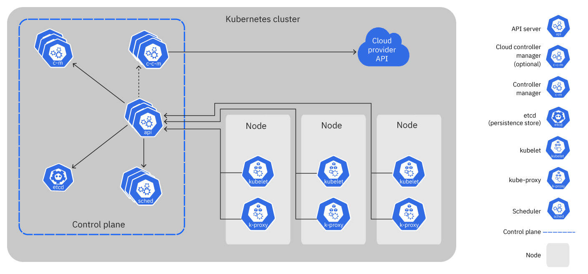

# Temario de Kubernetes desde cero para convertirme en un microservicio

## 1.0 Introducción a Kubernetes
- ¿Qué es Kubernetes?
- Beneficios y características de Kubernetes
- Arquitectura básica de Kubernetes
- Conceptos clave: clústeres, nodos, pods, servicios, volúmenes, etc.

## 2.0 Configuración del entorno de desarrollo
- Instalación de Docker
- Instalación de kubectl (CLI de Kubernetes)
- Configuración de un clúster de Kubernetes local (por ejemplo, minikube o kind)

## 3.0 Pods y Deployments
- Creación y administración de pods
- Trabajando con deployments
- Escalado horizontal y vertical de aplicaciones

## 4.0 Servicios en Kubernetes
- Exponiendo aplicaciones mediante servicios
- Tipos de servicios (ClusterIP, NodePort, LoadBalancer)
- Descubrimiento de servicios y DNS en Kubernetes

## 5.0 Almacenamiento en Kubernetes
- Volúmenes persistentes y almacenamiento en contenedores
- Provisión de almacenamiento en Kubernetes
- Gestión de volúmenes y reclamaciones de almacenamiento

## 6.0 Gestión de la configuración
- ConfigMaps: gestión de configuración y variables de entorno
- Secrets: almacenamiento seguro de información sensible
- Inyección de configuración en los contenedores

## 7.0 Monitoreo y registro de aplicaciones
- Supervisión de aplicaciones y recursos en Kubernetes
- Implementación de métricas y registros
- Uso de herramientas como Prometheus, Grafana y Elasticsearch

## 8.0 Escalado automático y alta disponibilidad
- Configuración de políticas de escalado automático
- Gestión de carga y balanceo de carga
- Estrategias de alta disponibilidad en Kubernetes

## 9.0 Gestión de la configuración y despliegues avanzados
- Helm: gestión de paquetes de aplicaciones Kubernetes
- Versionado y control de versiones de despliegues
- Despliegues canarios y de liberación gradual (blue-green deployments)

## 10.0 Implementación de microservicios en Kubernetes
- Diseño y despliegue de arquitecturas de microservicios
- Comunicación entre microservicios
- Implementación de patrones de tolerancia a fallos y recuperación

## 11.0 Seguridad en Kubernetes
- Conceptos de seguridad en Kubernetes
- Configuración de políticas de acceso y autorización
- Implementación de servicios seguros en Kubernetes

## 12.0 Operaciones avanzadas y administración del clúster
- Actualización y escalado de clústeres
- Resolución de problemas y depuración de aplicaciones
- Gestión de recursos y límites en Kubernetes

## 1.0 Introducción a Kubernetes    

### ¿Qué es Kubernetes? 

Kubernetes es una plataforma de código abierto diseñada para automatizar y administrar aplicaciones en contenedores a gran escala. También se le conoce como K8s, que es una abreviatura del nombre Kubernetes en el que se reemplazan los 8 caracteres "ubernete" con el número 8.

En pocas palabras, Kubernetes facilita la orquestación y gestión de contenedores en un entorno de clúster. Permite desplegar, escalar y administrar aplicaciones en contenedores de manera eficiente y confiable.

### Beneficios y características de Kubernetes

Kubernetes ofrece una serie de beneficios y características que lo convierten en una plataforma popular para la gestión de contenedores a gran escala. A continuación, se presentan algunos de los principales beneficios y características de Kubernetes:

1. Escalabilidad y capacidad de respuesta: Kubernetes permite escalar automáticamente las aplicaciones en función de la demanda de tráfico o la utilización de recursos. Puede aumentar o disminuir el número de réplicas de los contenedores de forma dinámica, lo que facilita la adaptación a cargas variables y garantiza una alta capacidad de respuesta.

2. Alta disponibilidad y tolerancia a fallos: Kubernetes proporciona mecanismos para la detección y recuperación automática de fallos en los nodos o contenedores. Si un nodo o contenedor falla, Kubernetes puede reprogramar automáticamente las tareas en otros nodos disponibles, lo que garantiza que las aplicaciones se ejecuten de manera continua y confiable.

3. Despliegue y actualización declarativa: Kubernetes permite definir la configuración de las aplicaciones mediante archivos de configuración en formato YAML o JSON. Esto permite un enfoque declarativo, donde se describe el estado deseado de la aplicación y Kubernetes se encarga de llevarla a cabo. Además, Kubernetes facilita las actualizaciones de aplicaciones sin tiempo de inactividad al implementar nuevas versiones gradualmente.

4. Gestión y orquestación de contenedores: Kubernetes administra y coordina la ejecución de contenedores en un clúster, lo que simplifica la administración de aplicaciones complejas que constan de múltiples contenedores interconectados. Proporciona herramientas para la programación, distribución, supervisión y escalado de contenedores de manera eficiente.

5. Servicios y descubrimiento de servicios: Kubernetes ofrece un sistema de servicios que permite exponer aplicaciones dentro del clúster y descubrirlas de manera transparente. Los servicios facilitan la comunicación entre los componentes de la aplicación y permiten la conectividad flexible y confiable entre los diferentes servicios.

6. Gestión de la configuración y secretos: Kubernetes proporciona mecanismos para la gestión centralizada de la configuración de las aplicaciones y el almacenamiento seguro de información sensible, como contraseñas o claves de API. Permite la inyección de configuración y secretos en los contenedores de forma segura y flexible.

7. Compatibilidad con múltiples entornos: Kubernetes es una plataforma agnóstica en cuanto a la infraestructura subyacente. Puede ejecutarse en diversos entornos, como en la nube (por ejemplo, Google Cloud, Azure, AWS), en entornos locales (mediante herramientas como minikube o kind) o en entornos híbridos. Esto proporciona flexibilidad y portabilidad a las aplicaciones.

En general, Kubernetes simplifica la gestión y operación de aplicaciones en contenedores, permitiendo un despliegue y escalamiento eficiente, una alta disponibilidad y una mayor agilidad en el desarrollo y despliegue de aplicaciones. Sus características y beneficios contribuyen a mejorar la eficiencia, la confiabilidad y la escalabilidad de las aplicaciones en entornos de producción.

### Arquitectura básica de Kubernetes

La arquitectura básica de Kubernetes se compone de varios componentes que trabajan juntos para gestionar y orquestar los contenedores en un clúster. A continuación, se describen los componentes principales de la arquitectura de Kubernetes:

1. ***Control plane (Nodo Maestro)***:
   - ***API Server***: Es el componente central de Kubernetes que expone la API REST utilizada para interactuar con el clúster. Los clientes, como la línea de comandos `kubectl`, se comunican con el API Server para enviar solicitudes y recibir respuestas.
   - ***etcd***: Es una base de datos distribuida y altamente disponible que almacena el estado del clúster, como la configuración, los objetos de la API y el estado de los pods y servicios.
   - ***Scheduler***: Es el encargado de asignar los pods a los nodos disponibles en el clúster, teniendo en cuenta los recursos disponibles y las políticas de programación definidas.
   - Controller Manager: Es un conjunto de controladores que se encargan de mantener y garantizar el estado deseado del clúster. Algunos controladores gestionan los despliegues, escalado, balanceo de carga, actualizaciones y otros aspectos del clúster.

2. ***Worker Nodes (Nodos de Trabajo)***:
   - ***Kubelet***: Es el agente que se ejecuta en cada nodo de trabajo y se comunica con el API Server para recibir instrucciones y gestionar los pods en el nodo. Se encarga de iniciar, detener y mantener los pods en ejecución.
    - ***Kube Proxy***: Es responsable de la configuración de la red en los nodos de trabajo. Proporciona un enrutamiento de red básico y balanceo de carga entre los servicios y los pods en el clúster.

3. Networking:
   - Cada pod tiene una dirección IP única y puede comunicarse directamente con otros pods en el mismo clúster a través de esta dirección IP.
   - Los servicios en Kubernetes proporcionan una abstracción para acceder a los pods de forma transparente, incluso cuando los pods se crean o se eliminan. Los servicios tienen una dirección IP fija y pueden tener asociado un equilibrador de carga.

4. Almacenamiento:
   - Kubernetes admite varios mecanismos de almacenamiento, como volúmenes persistentes, que permiten a los contenedores acceder y almacenar datos de forma persistente.

