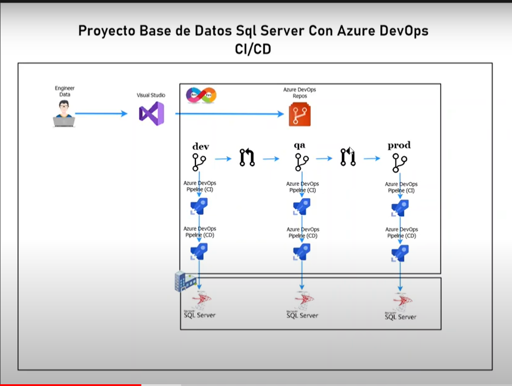

# Tools SQL Server 

Existen diferentes herramintas para trabajar con SQL Server  algunas extesiones para VSCODE  SQL Server (mssql), que tiene varias caracteristicas parar poder trabajar con base de datos SQL Server

con Visual Studio 
nos podemos conectar desde un explorador de Server   aqui un video  

https://www.youtube.com/watch?v=M0vvS5woWIo

https://www.youtube.com/watch?v=qW44w4HZoDw

https://www.youtube.com/watch?v=mcRgFuz_vYU